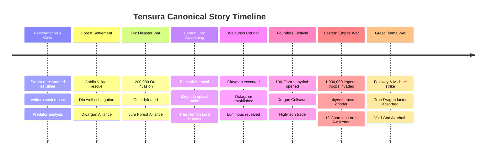

# 📜 TENSURA: CHRONOLOGY & MAJOR STORY ARCS

---

## ⏳ Complete Timeline of Canonical Events

---

## 📖 Chapter Breakdown & Major Historical Arcs

### 🔷 Arc 1: Reincarnation & The Sealed Cave (転生・洞窟編)
* Satoru Mikami is fatally stabbed in Tokyo and reincarnated in another world inside the **Sealed Cave**.
* Acquires **Unique Skill: Great Sage** and **Unique Skill: Predator**.
* Befriends the **Storm Dragon Veldora**; shares the family name **Tempest** and absorbs Veldora’s seal to decipher *Unlimited Imprisonment*.

### 🌲 Arc 2: The Goblin Village & Ogre Alliance (ジュラの森平定編)
* Saves the Goblin tribe from Direwolves; names **Rigurd**, **Gobta**, and **Ranga**, causing mass evolution.
* Travels to the **Armed Nation of Dwargon** to recruit master blacksmith **Kaijin** and the dwarf brothers.
* Meets the six surviving Ogre refugees; names them **Benimaru**, **Shion**, **Shuna**, **Souei**, **Hakuro**, and **Kurobe**, elevating them into noble **Kijin**.
* Inherits the dying will and human form of **Shizue Izawa (Conqueror of Flames)**.

### 🐖 Arc 3: The Orc Disaster War (豚頭魔王編)
* Gelmud unleashes the 200,000-man Orc army led by the **Orc Lord Geld**.
* Rimuru unites the Goblins, Kijin, Treyni's Dryads, and Gabil's Lizardmen into the **Jura Forest Alliance**.
* Rimuru devours Geld, forgiving his sins, and integrates 150,000 High Orcs into civilized society under the new **Geld II (Barrier Lord)**.

### 🦈 Arc 4: Dragonoid Milim & The Charybdis Incursion (魔王来訪・暴風大妖渦編)
* Ancient Demon Lord **Milim Nava** arrives in Tempest; Rimuru placates her with honey, forming an unbreakable friendship.
* Phobio summons the sky disaster **Charybdis**; Tempest mounts a defense until Milim vaporizes it with *Drago Buster*.

### 🏫 Arc 5: The Ingrassia Academy & Spirit Sanctuary (王都生活・精霊棲家編)
* Rimuru visits Ingrassia Kingdom to fulfill Shizu's wish and teach her 5 summoned Otherworlder students (Kenya, Ryota, Gale, Alice, Chloe).
* Travels to the **Queen of Spirits (Ramiris)** and has superior spirits inhabit the children, stabilizing their overflowing magicules and saving their lives.

### 💀 Arc 6: The Fall of Falmuth & The Harvest Festival (魔王覚醒編)
* Kingdom of Falmuth launches a surprise invasion with anti-magic barriers, slaughtering 100+ Tempest citizens including Shion.
* Driven by righteous wrath, Rimuru casts **Megiddo (God’s Wrath)**, eliminating the entire 20,000-man invading army in minutes.
* Consumes 20,000 souls to trigger the **Harvest Festival**, ascending to a **True Demon Lord**.
* Great Sage evolves into **Wisdom King Raphael**; casts *Secret Art of Spiritual Revival* to resurrect Shion and all fallen citizens.
* Summons **Primordial Black (Diablo / Noir)** to serve as his eternal butler and vanguard.

### 🎭 Arc 7: The Walpurgis Banquet (魔王達の宴 - ワルプルギス)
* Rimuru attends the sacred assembly of Demon Lords.
* Exposes Clayman's conspiracies; Shion beats Clayman in hand-to-hand combat, and Rimuru consumes him whole with *Beelzebuth*.
* The Ten Great Demon Lords restructure into the **Octagram (Eight Star Demon Lords)**.

### 🏰 Arc 8: The Tempest Founders Festival & The Labyrinth (開国祭・地下迷宮編)
* Tempest hosts the grandest cultural, culinary, and technology expo in the world.
* Rimuru and Ramiris construct the **100-Floor Dungeon Labyrinth**, appointing Zegion, Apito, Kumara, Adalman, and Veldora as floor bosses.

### 🎖️ Arc 9: The Eastern Empire Invasion (帝国侵略戦争編)
* The Eastern Empire sends 1,000,000 soldiers with high-tech airships and magi-tanks to conquer the Jura Forest.
* Tempest lures 700,000 soldiers directly into the **100-Floor Labyrinth**, where they are systematically annihilated by the Guardian Lords.
* Rimuru uses 700,000 harvested souls to awaken **Twelve True Demon Lords (The Twelve Guardian Lords)**.
* Rimuru defeats and absorbs the dragon factors of True Dragons **Veldora** and **Velgrynd**, evolving into an **Ultimate Slime** and awakening **Manas: Ciel** and **Void God Azathoth**.

### 🌌 Arc 10: The Great Tenma War (天魔大戦編)
* Supreme Angel **Feldway** and **Justice King Michael** unleash the Angelic Armies across the multiverse.
* Rimuru and the Octagram Demon Lords mount the final defense of reality, banishing cosmic despair and sealing eternal peace across the Cardinal World.
