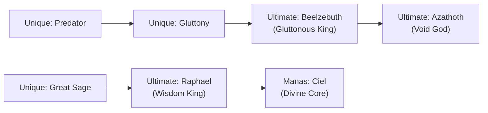

# ⚡ TENSURA: MAGIC, SKILLS & ULTIMATE ARTS COMPENDIUM

---

## 🧬 The Skill Hierarchy System

Skills in the Cardinal World are supernatural laws inscribed onto the spiritual core (soul) of an entity:

```
[Common Skills] ➔ [Intrinsic Skills] ➔ [Extra Skills] ➔ [Unique Skills] ➔ [Ultimate Skills] ➔ [Manas Core]
```

### 1. Skill Categories
1. **Intrinsic Skills (種族固有スキル)**:
   * Biological powers innate to a specific species (e.g. Slime's *Dissolve, Absorb, Regenerate*; Vampire's *Blood Drain*).
2. **Extra Skills (エクストラスキル)**:
   * High-tier practical enhancements (e.g. *Magic Sense, Shadow Step, Spatial Storage, Multilayer Barrier*).
3. **Unique Skills (ユニークスキル)**:
   * Powers born from immense desire, ego, or soul crystallization (e.g. *Great Sage, Predator, Deviant, Severer, Cook*).
4. **Ultimate Skills (究極能力 - Ultimate Skill)**:
   * The pinnacle of world authority. Grants mastery over specific physical and conceptual laws of the universe.
   * **Absolute Rule**: *Only an Ultimate Skill can counter or damage another Ultimate Skill.*

---

## 👑 Rimuru's Ultimate Skills Evolution



### 🌌 1. Void God Azathoth (虚空之神 - Azathoth)
* **Soul Consumption (魂暴食)**: Absolute devour ability capable of consuming time, space, magicules, and souls.
* **Turn Null / Nihility Collapse (虚無崩壊)**: Harnesses the chaotic, infinite destructive energy from the void before the creation of the universe.
* **Imaginary Space (虚数空間)**: Infinite pocket dimension with zero entropy, capable of housing entire stars and armies.
* **True Dragon Release & Core (竜種解放・竜種核化)**: Can manifest or channel the full power of Veldora and Velgrynd into sword cores.

### 🧠 2. Manas: Ciel (神智核 - Ciel)
* **Thought Acceleration**: Speeds up cognition by **several hundred million times**.
* **Appraisal & Synthesis**: Instant analysis of any magical phenomenon or enemy skill.
* **Skill Alteration & Duplication**: Modifies, synthesizes, or grants abilities to subordinates across the Soul Corridor.

### 🛡️ 3. Harvest King Shub-Niggurath (豊穣之王 - Shub-Niggurath)
* **Skill Creation**: Synthesizes brand-new abilities using stored data.
* **Skill Duplication & Gift**: Grants customized skill sets to loyal subordinates.
* **Skill Bank**: Infinite archive of every ability Rimuru has ever analyzed.

---

## ⚔️ The 7 Virtue Series vs 7 Sin Series Ultimate Skills

The two primordial pillars of Ultimate Skills created by the creator god Veldanava:

| Series | Ultimate Skill Name | Primary User | Core Concept |
| :--- | :--- | :--- | :--- |
| **Virtue (Angelic)** | **Wisdom King Raphael** (智慧之王) | Rimuru Tempest | Perfect calculation, law manipulation, universal truth. |
| **Virtue (Angelic)** | **Covenant King Uriel** (誓約之王) | Rimuru / Velgrynd | Absolute defense (*Universal Barrier*), spatial management. |
| **Virtue (Angelic)** | **Justice King Michael** (正義之王) | Rudra / Feldway | *Castle Guard* (absolute immunity based on loyal subjects), *Armageddon*. |
| **Virtue (Angelic)** | **Hope King Sariel** (希望之王) | Chloe Aubert | Life and death manipulation, ultimate healing, soul reversal. |
| **Virtue (Angelic)** | **Purity King Metatron** (純潔之王) | Leon Cromwell | Pure energy purification and spatial severing. |
| **Virtue (Angelic)** | **Patience King Gabriel** (忍耐之王) | Velzard | Absolute zero freezing, time deceleration, impenetrable defense. |
| **Virtue (Angelic)** | **Charity King Raguel** (救恤之王) | Velgrynd | Amplification of kinetic and thermal acceleration. |
| **Sin (Demonic)** | **Gluttonous King Beelzebuth** (暴食之王) | Rimuru Tempest | Soul devour, infinite stomach storage, matter digestion. |
| **Sin (Demonic)** | **Prideful King Lucifer** (傲慢之王) | Guy Crimson | Perfect duplication and understanding of any observed skill. |
| **Sin (Demonic)** | **Wrathful King Satanael** (憤怒之王) | Milim Nava | Infinite magicule generation scaling with anger/frenzy (*Stampede*). |
| **Sin (Demonic)** | **Greedy King Mammon** (強欲之王) | Yuuki / Mariabell | Stealing life force, desire manipulation, command theft. |
| **Sin (Demonic)** | **Slothful King Belphegor** (怠惰之王) | Dino | Energy accumulation through inactivity, devastating counter-attacks. |
| **Sin (Demonic)** | **Lustful King Asmodeus** (色欲之王) | Luminous Valentine | Life and death cycle mastery, resurrection, bio-drain. |
| **Sin (Demonic)** | **Envious King Leviathan** (嫉妬之王) | Velzard | Degradation and absorption of enemy power output. |

---

## 🪄 Magic Classifications

1. **Elemental Magic (元素魔法)**:
   * Manipulates the 5 physical elements (*Fire, Water, Wind, Earth, Space*) by altering atmospheric magicules.
2. **Spiritual Magic (精霊魔法)**:
   * Contracts with elemental spirits (e.g. Salamander, Undine, Sylph, Gnome) to produce natural disasters.
3. **Holy Magic (神聖魔法)**:
   * Channels spirit particles (Stardust / Light Spirit Particles) to purge demonic mana and cast *Resurrection* or *Disintegration*.
4. **Nuclear Strike Magic (核熱魔法 - Nuclear Magic)**:
   * High-tier military devastation spells (*Death Streak, Gravity Collapse, Abyss Annihilation*).

---

## 💥 Signature Attacks & Legendary Arts

* **Megiddo (God's Wrath - 神之怒)**:
  * Non-magical optical thermal strike. Rimuru conjures tens of thousands of floating water droplets shaped into convex lenses, concentrating sunlight into pinpoint supersonic thermal laser beams. Ignores anti-magic barriers and consumes zero MP.
* **Water Blade (水刃 - Water Slashes)**:
  * Ultra-pressurized thin blade of water accelerated with supersonic soundwave vibrations, slicing cleanly through heavy plate armor and stone.
* **Gluttony Barrier (暴食結界)**:
  * Translucent circular spatial vortex that directly swallows incoming elemental spells, arrows, and dragon breaths into Rimuru's stomach.
* **Drago Nova (竜星爆炎覇)**:
  * Milim Nava's supreme strike. Compresses infinite stardust magicules into a blinding blue pillar of light, capable of erasing mountain ranges from reality.
* **Disintegration (霊子崩壊)**:
  * Holy Church supreme art. Directs holy spiritrons that move faster than light to shatter atomic and spiritual bonds, completely eradicating physical and astral bodies.
