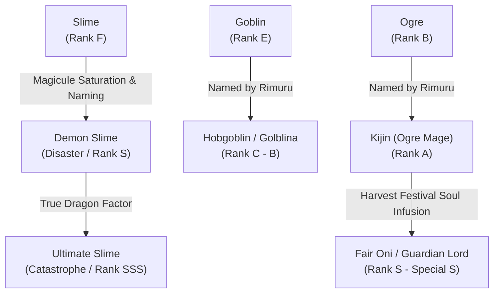

# 🎖️ TENSURA: TITLES, RANKS & EVOLUTION SYSTEMS

---

## 📊 Threat Level Classification System

The Western Nations and the Free Guild classify monsters and world threats into standard letter grades:

| Hazard Rank | Danger Classification | Estimated Destruction Potential | Canonical Examples |
| :--- | :--- | :--- | :--- |
| **Rank F – D** | Normal Class (低級魔物) | Threat to unarmed civilians. | Slimes, Horned Rabbits, Goblins |
| **Rank C – B** | Hazard Class (危険種) | Threat to small squads or villages. Requires trained adventurer parties. | Giant Spider, Evil Centipede, Direwolves |
| **Rank A** | Hazard / Special A (特A級) | Threat to an entire town or army battalion. | Tempest Serpent, Ogre Chiefs, Ifrit |
| **Rank S** | **Calamity Class** (災害級 - Calamity) | Threat to an entire small nation. Demon Lord Seed level. | Orc Lord Geld, Awakened Clayman |
| **Special S** | **Disaster Class** (天災級 - Disaster) | Threat to multiple kingdoms or a continent. True Demon Lord tier. | True Demon Lord Rimuru, Luminous, Leon |
| **Rank SS – SSS**| **Catastrophe Class** (天変地異級 - Catastrophe) | Threat to global civilization and existence. | Guy Crimson, Milim Nava, True Dragons (Veldora, Velgrynd) |

---

## 🧬 Monster Evolution & The Naming Mechanism

### Key Rules of Evolution:
1. **Naming (名付け)**:
   * Consumes the namer's permanent or regenerative magicules.
   * Monsters gain distinct human-like features, increased intelligence, higher magicule capacity, and refined martial capabilities.
2. **Harvest Festival (魔王への進化 - True Demon Lord Ascension)**:
   * Requires possession of a **Demon Lord Seed (魔王の種)**.
   * Requires sacrifice of **10,000 to 20,000 human souls** to trigger the transformation.
   * During the Harvest Sleep, all existing Unique Skills are pushed to evolutionary limits (*Wisdom King Raphael*, *Gluttonous King Beelzebuth*), and a **Gift (祝福 - Blessing)** is distributed to all named subordinates via the Soul Corridor.

---

## 👑 The Octagram of Demon Lords (八星魔王 - Eight Star Demon Lords)

After the defeat of Clayman and the restructuring of the Ten Great Demon Lords at the **Walpurgis Council**, the new council was renamed **Octagram (Eight-Pointed Star)**:

| Seat | Demon Lord Name | Epithet / Title | Race & True Domain |
| :--- | :--- | :--- | :--- |
| **1st** | **Guy Crimson** (ギィ・クリムゾン) | *Lord of Darkness* (暗黒皇帝) | Primordial Red Demon. The First Demon Lord. Ruler of the Northern Frozen Continent. |
| **2nd** | **Milim Nava** (ミリム・ナーヴァ) | *Destroyer* (破壊の暴君) | Dragonoid. Daughter of Veldanava. Wields infinite stardust magicules. |
| **3rd** | **Ramiris** (ラミリス) | *Labyrinth Fairy* (迷宮妖精) | Fairy Queen. Former Spirit Queen who calmed Milim's first rampage. |
| **4th** | **Dagruel** (ダグリュール) | *Earthquake Titan* (大地の怒り) | Ancient Giant Titan. Master of pure holy earth energy; rejects magical skills. |
| **5th** | **Luminous Valentine** (ルミナス・バレンタイン) | *Queen of Nightmares* (夜魔の女王) | Vampire True Ancestor. Sovereign of the Holy Empire Ruberios. |
| **6th** | **Dino** (ディーノ) | *Sleeping Ruler* (眠る支配者) | Fallen Angel of Origin. Ancient watcher stationed by Veldanava. |
| **7th** | **Leon Cromwell** (レオン・クロムウェル) | *Platinum Saber* (白銀の剣士) | Former Otherworlder Hero who turned into a Demon Lord to search for Chloe. |
| **8th** | **Rimuru Tempest** (リムル＝テンペスト) | *Chaos Creator* (新星 / 混沌の創造者) | Ultimate Slime. Ruler of the Great Jura Forest and Chancellor of Monsterkind. |
